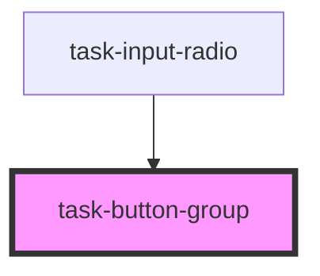

# task-button-group

<!-- Auto Generated Below -->

## Properties

| Property    | Attribute    | Description | Type      | Default    |
| ----------- | ------------ | ----------- | --------- | ---------- |
| `alignText` | `align-text` |             | `string`  | `"center"` |
| `fill`      | `fill`       |             | `boolean` | `false`    |
| `large`     | `large`      |             | `boolean` | `false`    |
| `minimal`   | `minimal`    |             | `boolean` | `false`    |
| `vertical`  | `vertical`   |             | `boolean` | `false`    |

## Dependencies

### Used by

 - [task-input-radio](../task-input-radio)

### Graph

----------------------------------------------

*Built with [StencilJS](https://stenciljs.com/)*
