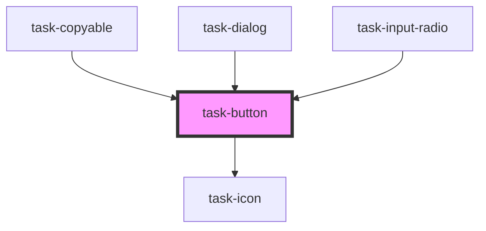

# task-button

<!-- Auto Generated Below -->

## Properties

| Property    | Attribute    | Description | Type      | Default     |
| ----------- | ------------ | ----------- | --------- | ----------- |
| `active`    | `active`     |             | `boolean` | `false`     |
| `alignText` | `align-text` |             | `string`  | `"center"`  |
| `anchor`    | `anchor`     |             | `boolean` | `false`     |
| `disabled`  | `disabled`   |             | `boolean` | `false`     |
| `fill`      | `fill`       |             | `boolean` | `false`     |
| `href`      | `href`       |             | `string`  | `undefined` |
| `icon`      | `icon`       |             | `string`  | `undefined` |
| `iconSize`  | `icon-size`  |             | `number`  | `undefined` |
| `intent`    | `intent`     |             | `string`  | `undefined` |
| `label`     | `label`      |             | `boolean` | `false`     |
| `large`     | `large`      |             | `boolean` | `false`     |
| `loading`   | `loading`    |             | `boolean` | `false`     |
| `minimal`   | `minimal`    |             | `boolean` | `false`     |
| `newWindow` | `new-window` |             | `boolean` | `false`     |
| `outlined`  | `outlined`   |             | `boolean` | `false`     |
| `rightIcon` | `right-icon` |             | `string`  | `undefined` |
| `selected`  | `selected`   |             | `boolean` | `false`     |
| `small`     | `small`      |             | `boolean` | `false`     |
| `target`    | `target`     |             | `string`  | `undefined` |
| `text`      | `text`       |             | `string`  | `undefined` |
| `type`      | `type`       |             | `string`  | `"button"`  |

## Dependencies

### Used by

 - [task-copyable](../task-copyable)
 - [task-dialog](../task-dialog)
 - [task-input-radio](../task-input-radio)

### Depends on

- [task-icon](../task-icon)

### Graph

----------------------------------------------

*Built with [StencilJS](https://stenciljs.com/)*
