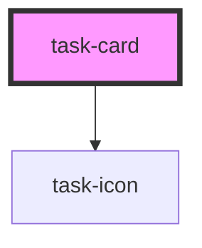

# task-card

<!-- Auto Generated Below -->

## Properties

| Property      | Attribute     | Description | Type      | Default     |
| ------------- | ------------- | ----------- | --------- | ----------- |
| `collapsable` | `collapsable` |             | `boolean` | `undefined` |
| `collapsed`   | `collapsed`   |             | `boolean` | `undefined` |
| `label`       | `label`       |             | `string`  | `undefined` |
| `width`       | `width`       |             | `string`  | `undefined` |

## Events

| Event               | Description | Type                    |
| ------------------- | ----------- | ----------------------- |
| `cardClicked`       |             | `CustomEvent<TaskCard>` |
| `cardReadyToSubmit` |             | `CustomEvent<boolean>`  |

## Methods

### `readyToSubmit() => Promise<boolean>`

#### Returns

Type: `Promise<boolean>`

## Dependencies

### Depends on

- [task-icon](../task-icon)

### Graph

----------------------------------------------

*Built with [StencilJS](https://stenciljs.com/)*
