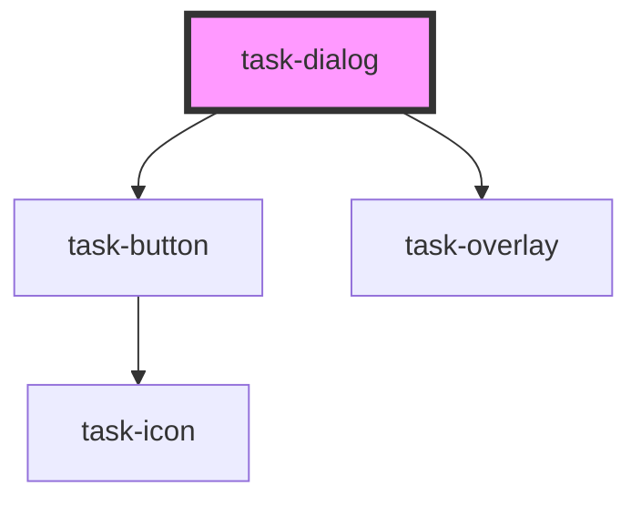

# task-dialog

<!-- Auto Generated Below -->

## Properties

| Property             | Attribute               | Description | Type      | Default     |
| -------------------- | ----------------------- | ----------- | --------- | ----------- |
| `headerText`         | `header-text`           |             | `string`  | `undefined` |
| `isCloseButtonShown` | `is-close-button-shown` |             | `boolean` | `true`      |
| `isOpen`             | `is-open`               |             | `boolean` | `true`      |

## Events

| Event   | Description | Type               |
| ------- | ----------- | ------------------ |
| `close` |             | `CustomEvent<any>` |

## Dependencies

### Depends on

- [task-button](../task-button)
- [task-overlay](../task-overlay)

### Graph

----------------------------------------------

*Built with [StencilJS](https://stenciljs.com/)*
