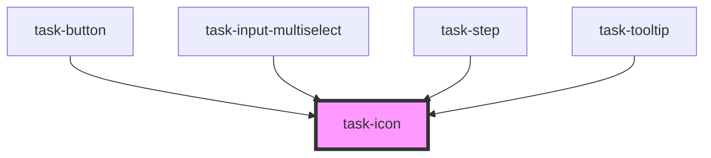

# task-icon

<!-- Auto Generated Below -->

## Properties

| Property | Attribute | Description | Type     | Default    |
| -------- | --------- | ----------- | -------- | ---------- |
| `icon`   | `icon`    |             | `string` | `"blank"`  |
| `size`   | `size`    |             | `number` | `STANDARD` |

## Dependencies

### Used by

 - [task-button](../task-button)
 - [task-input-multiselect](../task-input-multiselect)
 - [task-step](../task-step)
 - [task-tooltip](../task-tooltip)

### Graph

----------------------------------------------

*Built with [StencilJS](https://stenciljs.com/)*
