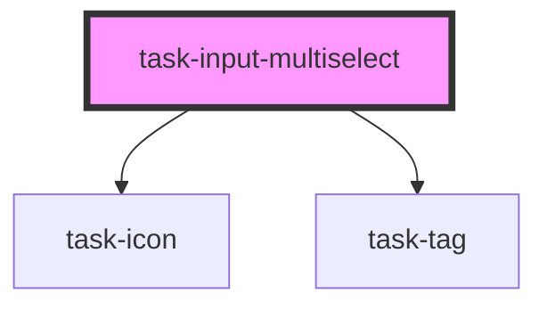

# task-input-multiselect

<!-- Auto Generated Below -->

## Properties

| Property            | Attribute            | Description | Type      | Default            |
| ------------------- | -------------------- | ----------- | --------- | ------------------ |
| `active`            | `active`             |             | `boolean` | `undefined`        |
| `disableIf`         | `disable-if`         |             | `string`  | `undefined`        |
| `disabled`          | `disabled`           |             | `boolean` | `undefined`        |
| `displayIf`         | `display-if`         |             | `string`  | `undefined`        |
| `displayOn`         | `display-on`         |             | `string`  | `undefined`        |
| `hidden`            | `hidden`             |             | `boolean` | `undefined`        |
| `label`             | `label`              |             | `string`  | `undefined`        |
| `labelClass`        | `label-class`        |             | `string`  | `undefined`        |
| `name`              | `name`               |             | `string`  | `undefined`        |
| `placeholder`       | `placeholder`        |             | `string`  | `"Select options"` |
| `requireIf`         | `require-if`         |             | `string`  | `undefined`        |
| `required`          | `required`           |             | `boolean` | `undefined`        |
| `requiredIndicator` | `required-indicator` |             | `string`  | `undefined`        |
| `value`             | `value`              |             | `string`  | `undefined`        |
| `valueFrom`         | `value-from`         |             | `string`  | `undefined`        |

## Events

| Event                      | Description | Type                                                            |
| -------------------------- | ----------- | --------------------------------------------------------------- |
| `inputUpdated`             |             | `CustomEvent<HTMLElement>`                                      |
| `registerKeyboardShortcut` |             | `CustomEvent<{ label: string; keys: string; value?: string; }>` |

## Methods

### `readyToSubmit() => Promise<boolean>`

#### Returns

Type: `Promise<boolean>`

### `setShowCorrections() => Promise<any>`

#### Returns

Type: `Promise<any>`

### `validateAgainstAnswer() => Promise<any>`

#### Returns

Type: `Promise<any>`

## Dependencies

### Depends on

- [task-icon](../task-icon)
- [task-tag](../task-tag)

### Graph

----------------------------------------------

*Built with [StencilJS](https://stenciljs.com/)*
