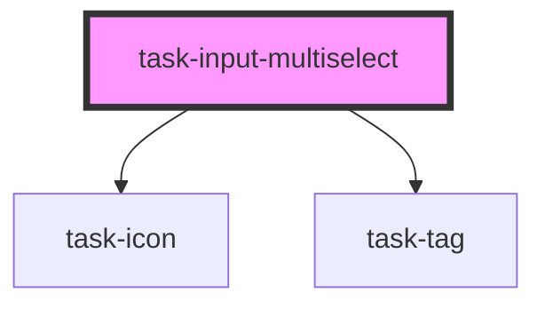

# task-input-multiselect

<!-- Auto Generated Below -->

## Properties

| Property      | Attribute     | Description | Type      | Default            |
| ------------- | ------------- | ----------- | --------- | ------------------ |
| `active`      | `active`      |             | `boolean` | `true`             |
| `disabled`    | `disabled`    |             | `boolean` | `false`            |
| `label`       | `label`       |             | `string`  | `undefined`        |
| `name`        | `name`        |             | `string`  | `undefined`        |
| `placeholder` | `placeholder` |             | `string`  | `"Select options"` |
| `required`    | `required`    |             | `boolean` | `undefined`        |

## Events

| Event                      | Description | Type                                                            |
| -------------------------- | ----------- | --------------------------------------------------------------- |
| `inputUpdated`             |             | `CustomEvent<HTMLElement>`                                      |
| `registerKeyboardShortcut` |             | `CustomEvent<{ label: string; keys: string; value?: string; }>` |

## Methods

### `readyToSubmit() => Promise<boolean>`

#### Returns

Type: `Promise<boolean>`

### `setShowCorrections(value: boolean) => Promise<void>`

#### Returns

Type: `Promise<void>`

### `setValue(value: string) => Promise<void>`

#### Returns

Type: `Promise<void>`

### `validateAgainstAnswer() => Promise<boolean>`

#### Returns

Type: `Promise<boolean>`

## Dependencies

### Depends on

- [task-icon](../task-icon)
- [task-tag](../task-tag)

### Graph

----------------------------------------------

*Built with [StencilJS](https://stenciljs.com/)*
