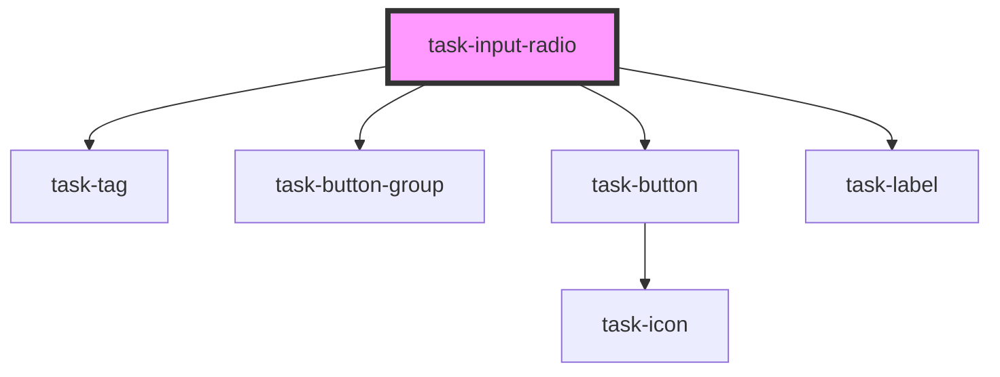

# task-input-radio

<!-- Auto Generated Below -->

## Properties

| Property            | Attribute            | Description | Type      | Default     |
| ------------------- | -------------------- | ----------- | --------- | ----------- |
| `answerTag`         | `answer-tag`         |             | `string`  | `"Answer"`  |
| `disableIf`         | `disable-if`         |             | `string`  | `undefined` |
| `disabled`          | `disabled`           |             | `boolean` | `undefined` |
| `displayIf`         | `display-if`         |             | `string`  | `undefined` |
| `displayOn`         | `display-on`         |             | `string`  | `undefined` |
| `hidden`            | `hidden`             |             | `boolean` | `undefined` |
| `inline`            | `inline`             |             | `boolean` | `undefined` |
| `label`             | `label`              |             | `string`  | `undefined` |
| `labelClass`        | `label-class`        |             | `string`  | `undefined` |
| `labelShortcuts`    | `label-shortcuts`    |             | `boolean` | `undefined` |
| `mode`              | `mode`               |             | `string`  | `"radio"`   |
| `name`              | `name`               |             | `string`  | `undefined` |
| `requireIf`         | `require-if`         |             | `string`  | `undefined` |
| `required`          | `required`           |             | `boolean` | `undefined` |
| `requiredIndicator` | `required-indicator` |             | `string`  | `undefined` |
| `value`             | `value`              |             | `string`  | `undefined` |
| `valueFrom`         | `value-from`         |             | `string`  | `undefined` |

## Events

| Event                      | Description | Type                                                                                                                              |
| -------------------------- | ----------- | --------------------------------------------------------------------------------------------------------------------------------- |
| `registerKeyboardShortcut` |             | `CustomEvent<{ label: string; keys: string; value?: string; }>`                                                                   |
| `tc:input`                 |             | `CustomEvent<{ input: HTMLInputElement \| HTMLSelectElement \| HTMLTextAreaElement; form: HTMLFormElement; advance?: boolean; }>` |

## Methods

### `readyToSubmit() => Promise<any>`

#### Returns

Type: `Promise<any>`

### `setShowCorrections() => Promise<any>`

#### Returns

Type: `Promise<any>`

### `validateAgainstAnswer() => Promise<boolean>`

#### Returns

Type: `Promise<boolean>`

## Dependencies

### Depends on

- [task-tag](../task-tag)
- [task-button-group](../task-button-group)
- [task-button](../task-button)
- [task-label](../task-label)

### Graph

----------------------------------------------

*Built with [StencilJS](https://stenciljs.com/)*
