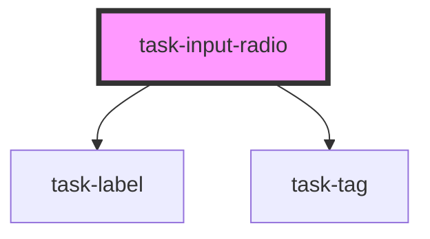

# task-input-radio

<!-- Auto Generated Below -->

## Properties

| Property    | Attribute    | Description | Type      | Default     |
| ----------- | ------------ | ----------- | --------- | ----------- |
| `active`    | `active`     |             | `boolean` | `true`      |
| `answerTag` | `answer-tag` |             | `string`  | `"Answer"`  |
| `disabled`  | `disabled`   |             | `boolean` | `false`     |
| `inline`    | `inline`     |             | `boolean` | `undefined` |
| `label`     | `label`      |             | `string`  | `undefined` |
| `name`      | `name`       |             | `string`  | `undefined` |
| `required`  | `required`   |             | `boolean` | `undefined` |

## Events

| Event                      | Description | Type                                                            |
| -------------------------- | ----------- | --------------------------------------------------------------- |
| `inputUpdated`             |             | `CustomEvent<HTMLFormElement>`                                  |
| `registerKeyboardShortcut` |             | `CustomEvent<{ label: string; keys: string; value?: string; }>` |

## Methods

### `readyToSubmit() => Promise<boolean>`

#### Returns

Type: `Promise<boolean>`

### `setShowCorrections(value: boolean) => Promise<void>`

#### Returns

Type: `Promise<void>`

### `setValue(value: string) => Promise<void>`

#### Returns

Type: `Promise<void>`

### `validateAgainstAnswer() => Promise<boolean>`

#### Returns

Type: `Promise<boolean>`

## Dependencies

### Depends on

- [task-label](../task-label)
- [task-tag](../task-tag)

### Graph

----------------------------------------------

*Built with [StencilJS](https://stenciljs.com/)*
