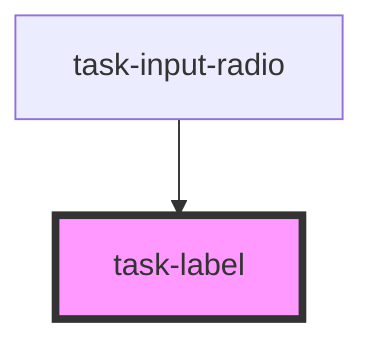

# task-label

<!-- Auto Generated Below -->

## Dependencies

### Used by

 - [task-input-radio](../task-input-radio)

### Graph

----------------------------------------------

*Built with [StencilJS](https://stenciljs.com/)*
