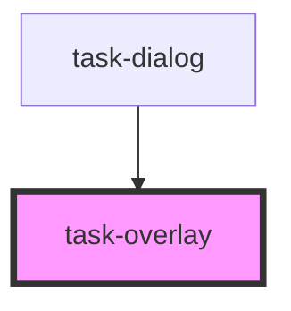

# task-overlay

<!-- Auto Generated Below -->

## Properties

| Property                   | Attribute                      | Description | Type      | Default     |
| -------------------------- | ------------------------------ | ----------- | --------- | ----------- |
| `autoFocus`                | `auto-focus`                   |             | `boolean` | `true`      |
| `backdropClass`            | `backdrop-class`               |             | `string`  | `undefined` |
| `canEscapeKeyClose`        | `can-escape-key-close`         |             | `boolean` | `true`      |
| `canOutsideClickClose`     | `can-outside-click-close`      |             | `boolean` | `true`      |
| `containerClass`           | `container-class`              |             | `string`  | `undefined` |
| `enforceFocus`             | `enforce-focus`                |             | `boolean` | `true`      |
| `hasBackdrop`              | `has-backdrop`                 |             | `boolean` | `true`      |
| `isOpen`                   | `is-open`                      |             | `boolean` | `undefined` |
| `shouldReturnFocusOnClose` | `should-return-focus-on-close` |             | `boolean` | `true`      |
| `transitionDuration`       | `transition-duration`          |             | `number`  | `300`       |
| `transitionName`           | `transition-name`              |             | `string`  | `"overlay"` |

## Events

| Event     | Description | Type               |
| --------- | ----------- | ------------------ |
| `close`   |             | `CustomEvent<any>` |
| `closed`  |             | `CustomEvent<any>` |
| `closing` |             | `CustomEvent<any>` |
| `opened`  |             | `CustomEvent<any>` |
| `opening` |             | `CustomEvent<any>` |

## Dependencies

### Used by

 - [task-dialog](../task-dialog)

### Graph

----------------------------------------------

*Built with [StencilJS](https://stenciljs.com/)*
