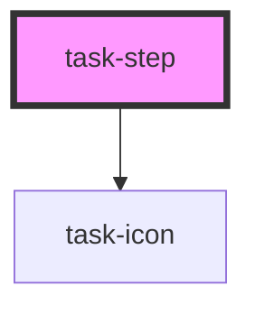

# task-step

<!-- Auto Generated Below -->

## Properties

| Property | Attribute | Description | Type      | Default     |
| -------- | --------- | ----------- | --------- | ----------- |
| `active` | `active`  |             | `boolean` | `undefined` |
| `label`  | `label`   |             | `string`  | `undefined` |

## Events

| Event               | Description | Type                    |
| ------------------- | ----------- | ----------------------- |
| `cardClicked`       |             | `CustomEvent<TaskStep>` |
| `cardReadyToSubmit` |             | `CustomEvent<boolean>`  |

## Methods

### `readyToSubmit() => Promise<boolean>`

#### Returns

Type: `Promise<boolean>`

## Dependencies

### Depends on

- [task-icon](../task-icon)

### Graph

----------------------------------------------

*Built with [StencilJS](https://stenciljs.com/)*
