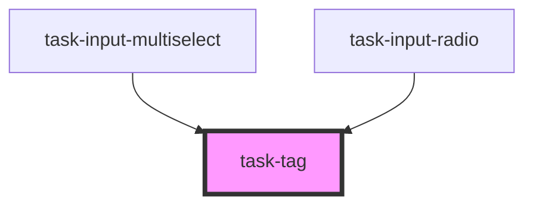

# task-tag

<!-- Auto Generated Below -->

## Properties

| Property      | Attribute     | Description | Type         | Default     |
| ------------- | ------------- | ----------- | ------------ | ----------- |
| `color`       | `color`       |             | `string`     | `undefined` |
| `interactive` | `interactive` |             | `boolean`    | `undefined` |
| `large`       | `large`       |             | `boolean`    | `undefined` |
| `minimal`     | `minimal`     |             | `boolean`    | `undefined` |
| `onremove`    | --            |             | `() => void` | `() => {}`  |
| `removable`   | `removable`   |             | `boolean`    | `undefined` |
| `round`       | `round`       |             | `boolean`    | `undefined` |
| `small`       | `small`       |             | `boolean`    | `undefined` |

## Dependencies

### Used by

 - [task-input-multiselect](../task-input-multiselect)
 - [task-input-radio](../task-input-radio)

### Graph

----------------------------------------------

*Built with [StencilJS](https://stenciljs.com/)*
